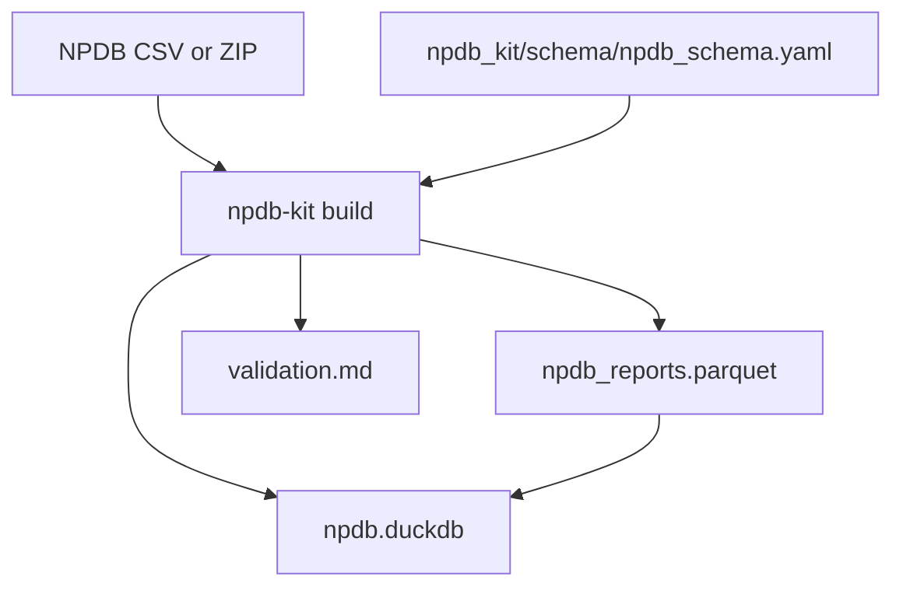

# npdb-public-data-kit

> **IMPORTANT: This tool is for aggregate statistical analysis only.**
>
> This project uses the NPDB Public Use Data File, which is de-identified
> public data released by HRSA for research purposes. This tool does NOT
> support and must NOT be used for:
> - Identifying individual practitioners
> - Credentialing decisions
> - Re-identification or cross-referencing with other datasets
> - Any form of individual-level accusation or discrimination
>
> Users are responsible for compliance with all applicable laws and the
> NPDB terms of use. Aggregate analyses should suppress cells with
> fewer than 11 records to prevent indirect identification.

Open-source toolkit for ingesting, validating, and analyzing the [NPDB Public Use Data File](https://www.npdb.hrsa.gov/resources/publicData.jsp).

## What this tool does

- Loads locally downloaded NPDB CSV (or ZIP containing CSV)
- Validates schema and data quality
- Exports clean Parquet
- Builds a local DuckDB warehouse with aggregate views (cell suppression applied)

## What this tool does NOT do

- No practitioner lookup, search, or query commands
- No joins with external practitioner databases
- No export of individual-level records grouped by practitioner
- No support for restricted NPDB query workflows
- No geocoding beyond state level

## Quickstart

```bash
# Install (from repo root)
pip install -e ".[dev]"

# Download NPDB Public Use Data File from HRSA (CSV format)
# https://www.npdb.hrsa.gov/resources/publicData.jsp

# Build clean Parquet + DuckDB warehouse
npdb-kit build ./NPDB2603.CSV --output ./output

# Validate only
npdb-kit validate ./NPDB2603.CSV --output ./output/validation.md
```

## Output

Running `npdb-kit build` creates:

```
output/
├── npdb_reports.parquet   # cleaned data (practnum stripped by default)
├── validation.md          # data quality report
└── npdb.duckdb            # DuckDB warehouse with aggregate views
```

### DuckDB views

- `v_reports_by_year`
- `v_reports_by_state`
- `v_reports_by_record_type`
- `v_malpractice_payment_trends`

All views suppress groups with fewer than 11 records.

## Architecture



## Development

```bash
pip install -e ".[dev]"
pytest
ruff check .
ruff format .
```

## Data source

See [docs/data-source.md](docs/data-source.md) for download instructions.

## License

MIT
